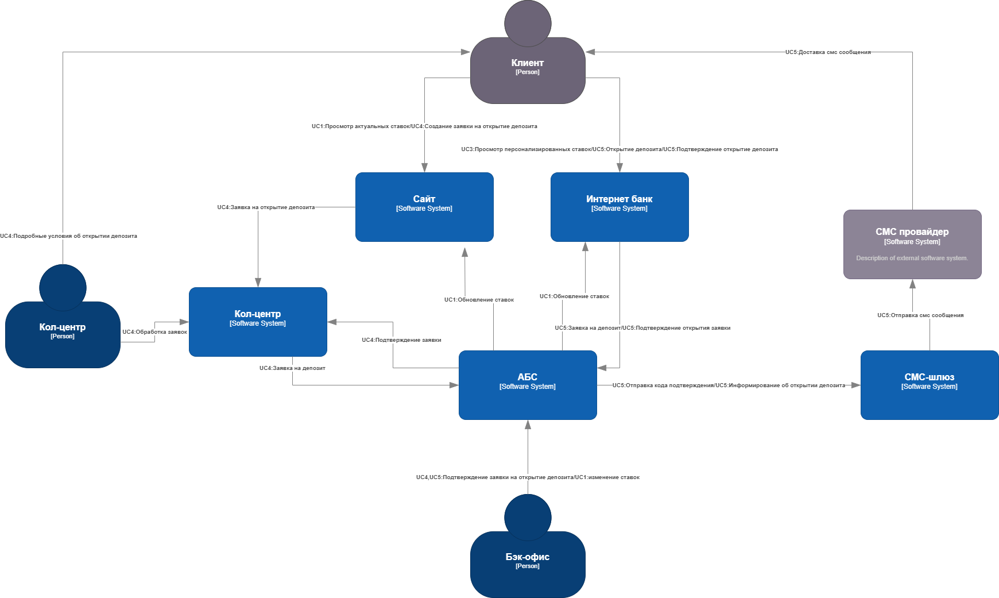
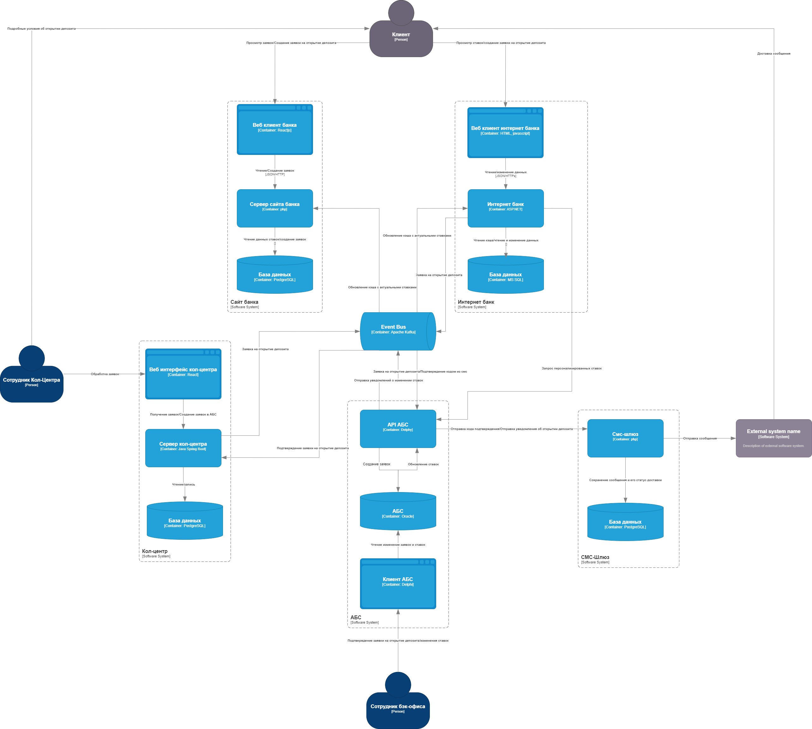

### **Название задачи: Открытие депозитов онлайн** 
### **Автор: Столяров Михаил**
### **Дата: 20.02.2025**
### **Функциональные требования**

| **№** | **Действующие лица или системы**               | **Use Case**                          | **Описание**                                                                                                                                                                                                                                                                                                                                                                                                                                                                                                 |
|:-----:|:-----------------------------------------------|:--------------------------------------|:-------------------------------------------------------------------------------------------------------------------------------------------------------------------------------------------------------------------------------------------------------------------------------------------------------------------------------------------------------------------------------------------------------------------------------------------------------------------------------------------------------------|
|  UC1  | Сайт, Интернет-банк, Kafka, АБС                | Обновление ставок депозита            | 1. При изменении ставок АБС публикует событие об изменении ставки 2. Сайт и интернет-банк кэшируют изменения ставок в своих БД.                                                                                                                                                                                                                                                                                                                                                                          |
|  UC2  | Клиент, Сайт                                   | Список доступных ставок               | 1. Клиент переходит на сайт в раздел депозитов 2. Сайт возвращает список актуальных ставок из кэша.                                                                                                                                                                                                                                                                                                                                                                                                      |
|  UC3  | Клиент, Интернет-банк, АБС                     | Список персональных ставок            | 1. Клиент заходит в интернет-банк 2. Интернет-банк запрашивает персональные ставки клиента у АБС 3. Интернет-банк в выводит актуальные ставки из кэша и дополняет персональными ставками полученными из АБС.                                                                                                                                                                                                                                                                                         |
|  UC4  | Клиент, Сайт, Кол-центр, бэк офис, АБС         | Открытие депозита через сайт          | 1. Клиент переходит на страницу сайта `открытия депозита 2. Оставляет Ф.И.О, номер телефона и сумму депозита 3. Сотрудник кол-центра отправляет заявку в АБС. 4. Сотрудник бэк-офиса подтверждает возможность открытия депозита и отправляет решение в кол-центр. 6. Сотрудник кол-центра связывается с клиентом и рассказывает об условиях по депозиту.                                                                                                                                     |
|  UC5  | Клиент, Интернет-банк, смс-шлюз, бэк офис, АБС | Открытие депозита через Интернет банк | 1. Клиент переход на страницу интернет банка открытия депозита. 2. Оформляет заявку на открытие депозита с указанием суммы. 3. Интернет-банк создает заявку в АБС 4. АБС для подтверждения заявки отправляет код смс сообщением.  5. Клиент подтверждает заявку вводом кода из смс сообщения. 6. Интернет-банк отправляет код подтверждение в АБС. 7. Сотрудник бэк-офиса подтверждает заявку в АБС. 8. АБС отправляет СМС сообщение клиенту с информацией об открытии депозита. | 

### **Нефункциональные требования**

| **№** | **Требование**                                                                           |
|:-----:|:-----------------------------------------------------------------------------------------|
|   R   | Надёжность (Reliability)                                                                 |
|  R1   | Все сервисы должны работать 24/7 и быть доступны в 99.99% случаев.                       |
|  R2   | Сервис должен быть геораспределен.                                                       |
|   P   | Производительность (Performance)                                                         |
|  P1   | Отклик по операциям должен занимать не более 20 миллисекунд.                             |
|  P2   | Сервис должен иметь возможность горизонтального масштабирования.                         |
|  P3   | Клиентские запросы должны отправляться в ближайший ЦОД.                                  |
|  +R   | + Ограничения (Restricitions)                                                            |
|  +R1  | Сервис должен придерживаться системы дизайна для приложений, которая принята в компании. |
|  +R2  | Интернет банк может разрабатываться c использованием микросервисной архитектуры          |
|  +R3  | Для очередей сообщений использовать Kafka.                                               |
|  +R5  | Для реализации новых функций предпочтительно использовать БД MS SQL и Oracle             |
|  +R6  | Интернет-банк должен избежать прямой работы с API АБС и не нагружать базу данных АБС.    |
|  +R7  | Функционал работы СМС должен быть разработан силами внутренних сотрудников банка.        |
|  +R8  | Клиентские подключения должны использовать протокол https                                |
|  +R9  | Подключения интернет банка должны использовать протокол https                            |
| +R10  | Для разработки должны использоваться  ASP.NET, PHP, react.js, PL-SQL                     |

### **Решение**

Диаграмма контекста

Диаграмма контейнеров

- Для создания API АБС выбран язык программирования Delphi потому, что клиентская часть написана на delphi и можно будет часть кода перенести в API.
- СМС-шлюз - разрабатывается на php т.к. в ит отделе есть специалисты по php.

### **Альтернативы**

1. Вертикально масштабировать систему АБС и отказаться от внедрения kafka и от создания микросервиса AБС API. Благодаря этому пути можно быстрее создать MVP, но есть ограничения в масшатибровании.

**Недостатки, ограничения, риски**

1. Внедрение Kafka требует доработки систем подрядчиков: Кол-центр, Интернет-банк.

