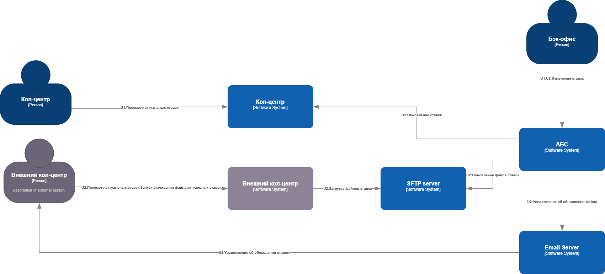
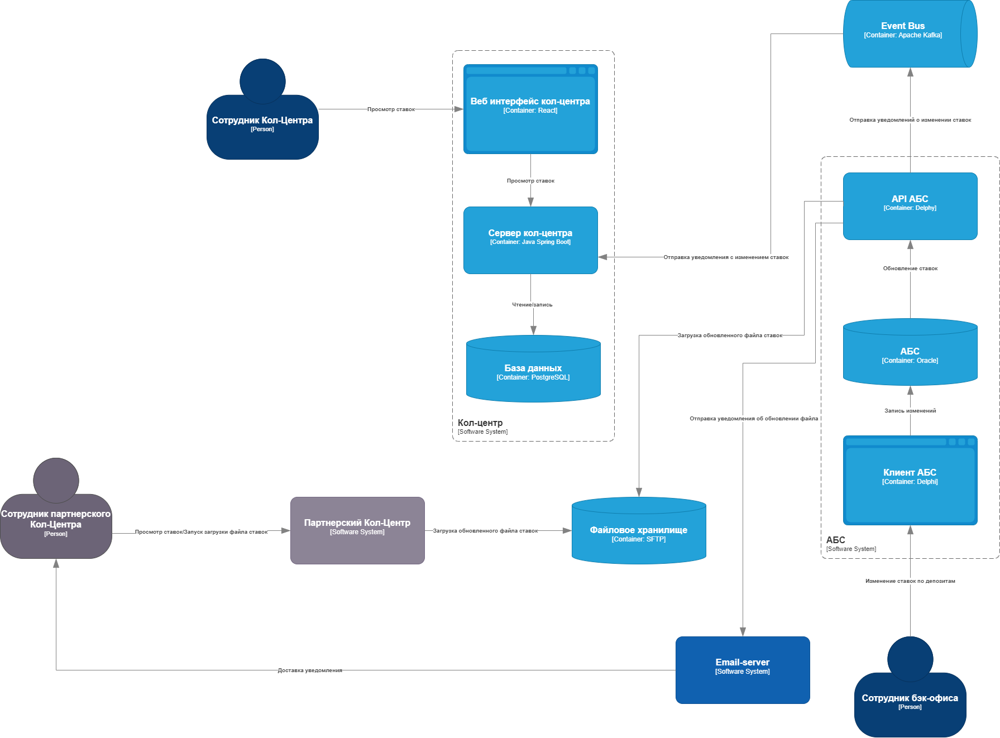

### **Название задачи: Передача ставок в кол-центр** 
### **Автор: Столяров Михали**
### **Дата:22.02.2025**
### **Функциональные требования**

| **№** | **Действующие лица или системы**                      | **Use Case**                                         | **Описание**                                                                                                                                                                                                                                                                                                                                                      |
|:-----:|:------------------------------------------------------|:-----------------------------------------------------|:------------------------------------------------------------------------------------------------------------------------------------------------------------------------------------------------------------------------------------------------------------------------------------------------------------------------------------------------------------------|
|  UC1  | Кол-центр, АБС                                        | Предоставление доступа к ставкам системе кол-центра. | 1. Сотрудник бэк-офиса меняет ставки по депозитам. 2. Система АБС публикует уведомление в kafka. 3. Система кол-центра обновляет кэш со ставками по депозитам.                                                                                                                                                                                            |
|  UC2  | Партнерский кол-центр, АБС, email-server, sftp-server | Загрузка файлов ставок.                              | 1. Сотрудник бэк-офиса меняет ставки по депозитам. 2. Система АБС экспортирует файл с новыми ставками на sftp сервер. 3. Система АБС отправляет уведомление по email о загруженном новом файле. 4. Сотрудники партнерского кол-центра загружают обновленный файл. 5. Раз в сутки загрузка  файла в приложение кол-центра происходит автоматически |

### **Нефункциональные требования**

| **№** | **Требование**                                                         |
|:-----:|:-----------------------------------------------------------------------|
|   R   | Надёжность (Reliability)                                               |
|  R1   | Все сервисы должны работать 24/7 и быть доступны в 99.99% случаев.     |
|  +R   | + Ограничения (Restricitions)                                          |
|  +R1  | Партнерский кол-центр имеет возможность загружать файлы только по sftp |

### **Решение**
Диаграмма контекста

Диаграмма контейнеров

Так как общие ставки по депозитам являются публичной информацией которая также размещается на сайте, то простого sftp сервера достаточно.

### **Альтернативы**

1. Альтернативой может быть предоставления доступа к сайту банка где публикуются и обновляются текущий ставки по депозитам. Это позволит сэкономить на доработке сервисов по загрузке и выгрузке файлов.
2. Не использовать файловый сервер, а отправлять файл по email как раньше. Не вручную, а автоматически.

**Недостатки, ограничения, риски**

Технические:
1. При взломе sftp сервера злоумышленник может загрузить вредоносный файл или файл с неточной информацией.
2. Сотрудникам партнерского кол-центра необходимо отслеживать почту на наличие уведомления об изменении файла ставок.
3. Сложность интеграции АБС с кол-центром через kafka.

Бизнес:

1. Дополнительные расходы на дообучение сотрудников.
2. Из-за задержек обновления ставок в системах кол-центра, клиентам будут озвучены старые ставки. Может привести к потерям клиентов и репутации банка.

## Список задач

