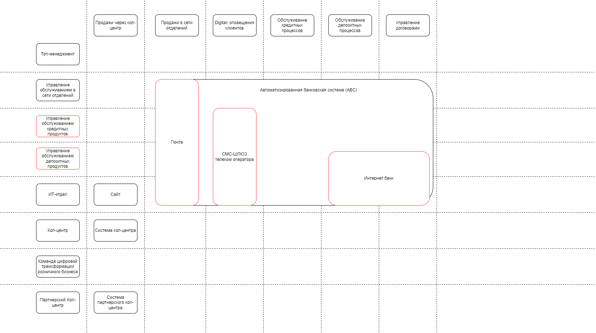
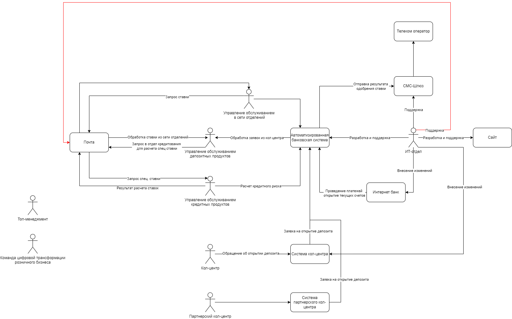
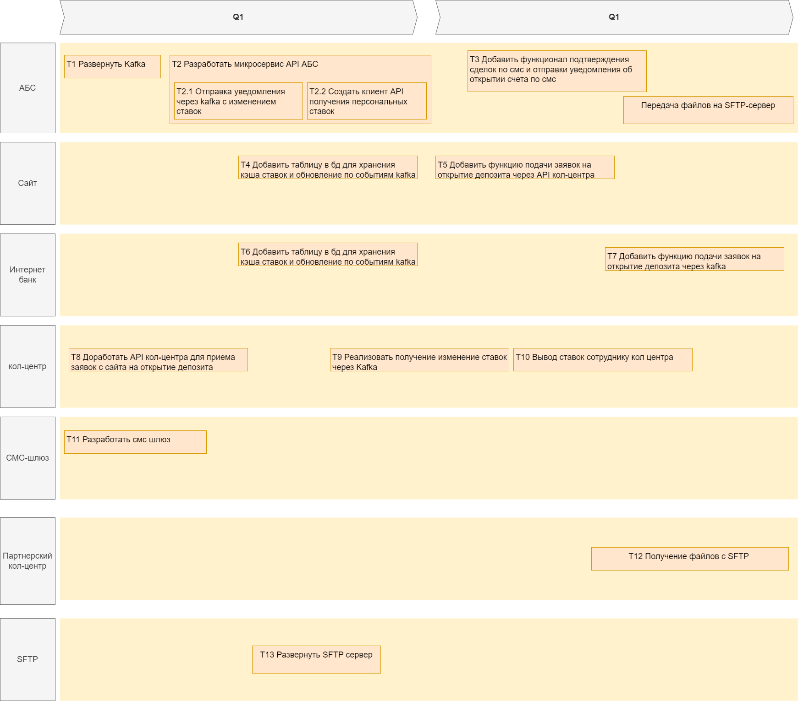

# architecture-sprint-9

## Задание 1
Карта текущего IT-ландшафта

Схема интеграции приложений

## Задание 2
Таблица FURPS+

[FURPS.md](Exc2/FURPS.md)

## Задание 3

Решение в формате ADR:

[ADR.md](Exc3/ADR.md)

## Задание 4

Решение в формате ADR:

[ADR.md](Exc4/ADR.md)

RoadMap:

